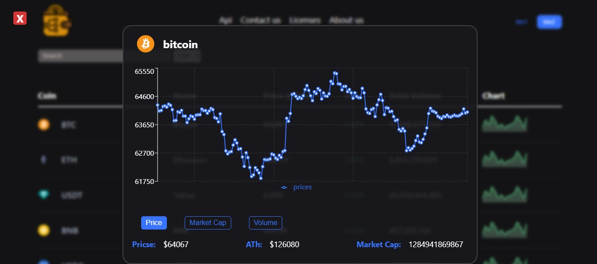
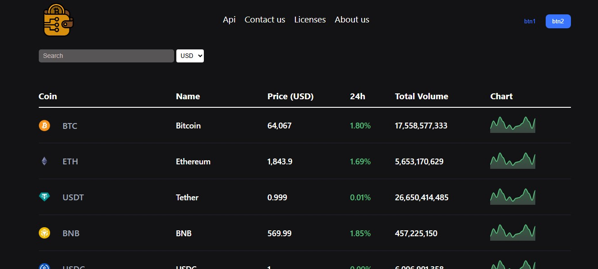

# 🚀 Crypto Currency App


A modern cryptocurrency tracking application built with **React** and **Vite** that displays real-time cryptocurrency market data using the **CoinGecko API**. Users can search for cryptocurrencies, switch between different currencies, and visualize historical market data with interactive charts.

---

## ✨ Features

* 📈 Real-time cryptocurrency market data
* 🔍 Search cryptocurrencies by name or symbol
* 📊 Interactive charts
* 💹 View:

  * Price History
  * Market Capitalization
  * Trading Volume
* 📅 Formatted chart dates
* 💱 Multiple currency support (USD, EUR, JPY)
* ⚡ Fast and responsive interface
* ⏳ Loading indicators while fetching data

---

## 🎓 Key Learning Points

This project was built to strengthen my front-end development skills and gain hands-on experience with modern React development.

Throughout this project, I practiced and learned:

* ⚛️ Building reusable React components
* 🎣 Managing state and side effects with React Hooks (`useState`, `useEffect`)
* 🌐 Fetching and consuming REST APIs
* 🔄 Transforming API responses into reusable data structures
* 📊 Creating interactive charts with **Recharts**
* 📅 Formatting timestamps using JavaScript's **Date API** and `toLocaleDateString()`
* 🧩 Writing reusable helper functions
* 💱 Working with multiple currencies (USD, EUR, JPY)
* 🔍 Implementing real-time cryptocurrency search
* 🎨 Styling components with **CSS Modules**
* 📂 Organizing projects using a scalable folder structure
* 📝 Following the **Conventional Commits** specification for Git commit messages
* ⚡ Building and developing with **Vite**
* 🐛 Debugging React applications and solving common rendering issues
* 📖 Writing clean, maintainable, and readable code

---

## 📚 Resources

* **CoinGecko API** – Cryptocurrency market data
* **Recharts** – React charting library
* **MDN Web Docs** – JavaScript Date API and modern JavaScript features
* **React Documentation** – React Hooks and component architecture
* **Vite Documentation** – Front-end tooling and development server
---

## 🌐 API

This project uses the **CoinGecko API** to retrieve live cryptocurrency data.

API endpoints used include:

* Markets
* Search
* Market Chart (Historical Data)

---

## 📅 Date Formatting

Chart dates are formatted using JavaScript's built-in **Date** object and **Intl / `toLocaleDateString()`** API for clean and localized date labels.

---

## 📝 Git Workflow

This project follows the **Conventional Commits** specification for meaningful and consistent commit messages.

Examples:

```text
feat: add cryptocurrency search
fix: correct chart tooltip formatting
refactor: simplify data conversion helper
style: improve responsive layout
```

---

## 📁 Project Structure

```text
src/
│
├── components/
├── helpers/
│   ├── convertData.js
│   └── formatDate.js
├── services/
├── layout/
├── pages/
└── App.jsx
```

---

## 🚀 Getting Started

Clone the repository:

```bash
git clone https://github.com/your-username/crypto-currency.git
```

Install dependencies:

```bash
npm install
```

Run the development server:

```bash
npm run dev
```

---


⭐ If you found this project useful, consider giving it a star!
